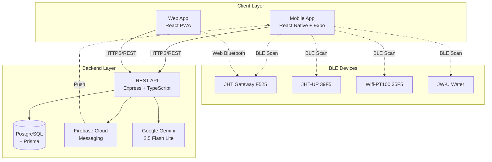
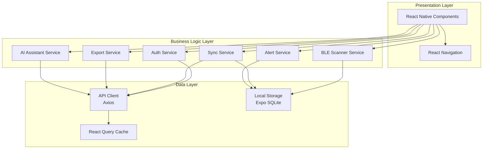
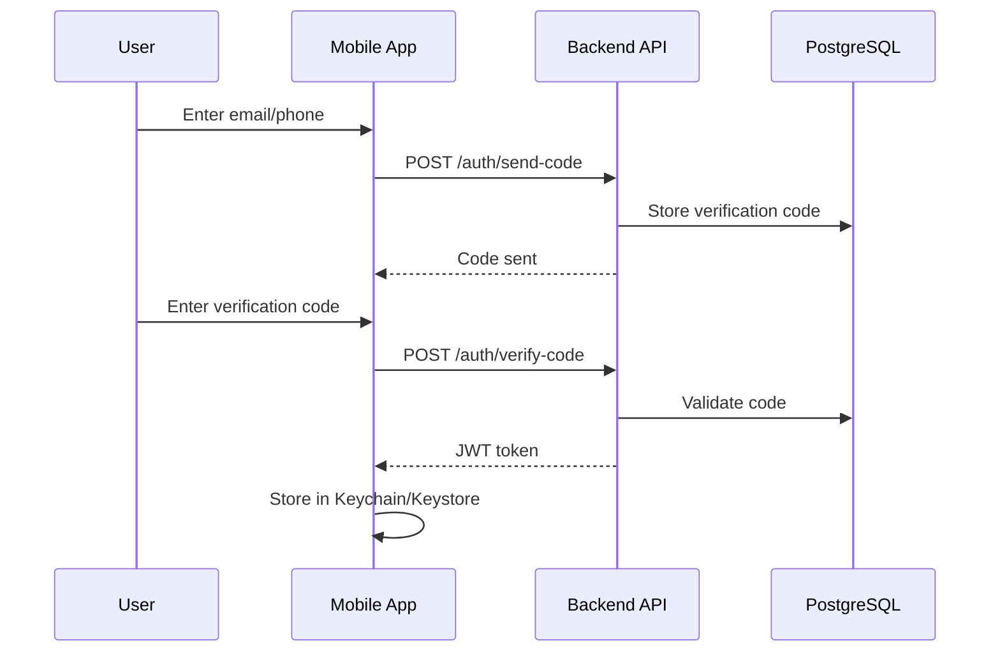
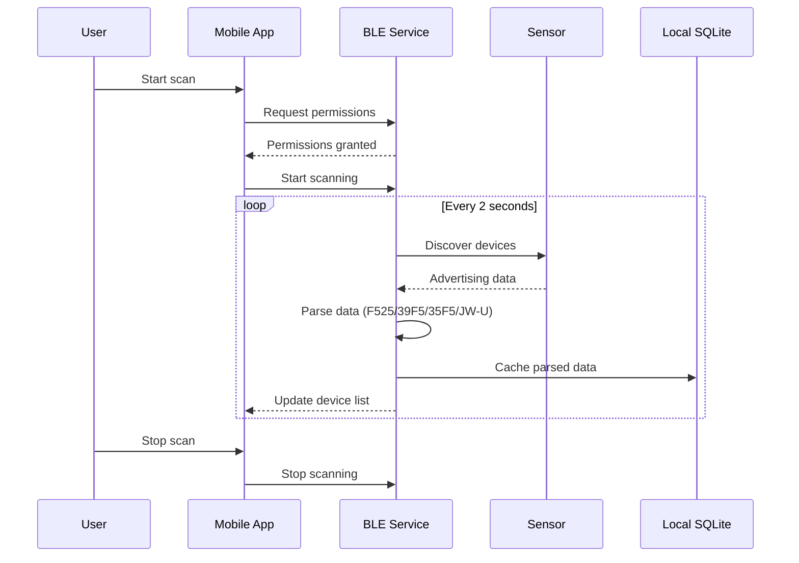
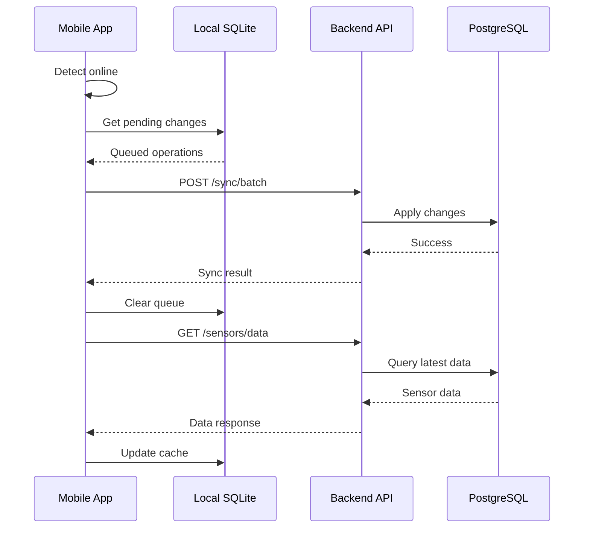

# Design Document: Cross-Platform Mobile App

## Overview

Este documento descreve o design técnico para o sistema Climatic Pro, uma plataforma completa de monitoramento de sensores ambientais que inclui aplicativos móveis nativos (Android/iOS), plataforma web (PWA), e backend escalável.

### System Architecture

O sistema é composto por três camadas principais:

1. **Mobile Layer**: Aplicativos nativos React Native + Expo para Android e iOS
2. **Web Layer**: Progressive Web App (PWA) React mantendo funcionalidades existentes
3. **Backend Layer**: API REST Node.js com PostgreSQL e Prisma ORM

### Technology Stack

**Mobile (React Native + Expo)**
- React Native 0.73+
- Expo SDK 50+
- React Navigation 6.x para navegação
- React Native BLE Manager para Bluetooth
- Expo SQLite para armazenamento local
- React Query para gerenciamento de estado servidor
- Zustand para estado global cliente

**Web (React PWA)**
- React 18+
- Vite como bundler
- Web Bluetooth API para BLE
- Service Workers para offline
- IndexedDB para cache local

**Backend**
- Node.js 20+ com TypeScript
- Express.js para API REST
- PostgreSQL 15+ como banco de dados
- Prisma ORM para queries e migrations
- JWT para autenticação
- Firebase Cloud Messaging para push notifications

**AI Integration**
- Google Gemini 2.5 Flash Lite API

## Architecture

### High-Level Architecture



### Mobile App Architecture



### Data Flow

**Authentication Flow**


**BLE Scanning Flow**


**Data Sync Flow**


## Components and Interfaces

### Mobile App Components

**Navigation Structure**
```
AppNavigator (Stack)
├── AuthNavigator (Stack)
│   ├── LoginScreen
│   ├── VerifyCodeScreen
│   └── DemoModeScreen
└── MainNavigator (Tab)
    ├── DashboardTab
    │   ├── DashboardScreen
    │   └── SensorDetailsScreen
    ├── ScanTab
    │   └── BLEScanScreen
    ├── AITab
    │   └── AIAssistantScreen
    ├── AlertsTab
    │   ├── AlertsListScreen
    │   └── AlertConfigScreen
    └── SettingsTab
        └── SettingsScreen
```

**Core Components**

1. **SensorCard Component**
```typescript
interface SensorCardProps {
  sensor: Sensor;
  onPress: () => void;
  showAlerts: boolean;
}
```

2. **BLEScanner Component**
```typescript
interface BLEScannerProps {
  onDeviceFound: (device: BLEDevice) => void;
  isScanning: boolean;
  onToggleScan: () => void;
}
```

3. **ChartView Component**
```typescript
interface ChartViewProps {
  data: SensorReading[];
  parameter: 'temperature' | 'humidity' | 'co2' | 'pm25' | 'tvoc';
  period: '24h' | '7d' | '30d' | '90d';
  onZoom: (range: DateRange) => void;
}
```

4. **AIChat Component**
```typescript
interface AIChatProps {
  messages: ChatMessage[];
  onSendMessage: (text: string) => void;
  isLoading: boolean;
  sensorContext: Sensor[];
}
```

### Backend API Endpoints

**Authentication**
- `POST /api/v1/auth/send-code` - Enviar código de verificação
- `POST /api/v1/auth/verify-code` - Verificar código e retornar JWT
- `POST /api/v1/auth/refresh` - Renovar token JWT
- `POST /api/v1/auth/logout` - Invalidar token

**Sensors**
- `GET /api/v1/sensors` - Listar sensores do usuário (paginado)
- `GET /api/v1/sensors/:id` - Detalhes de um sensor
- `POST /api/v1/sensors` - Adicionar novo sensor
- `PATCH /api/v1/sensors/:id` - Atualizar sensor (alias, configurações)
- `DELETE /api/v1/sensors/:id` - Remover sensor

**Sensor Data**
- `GET /api/v1/sensors/:id/data` - Dados históricos (paginado, filtros de data)
- `POST /api/v1/sensors/:id/data` - Inserir leitura manual
- `GET /api/v1/sensors/:id/data/latest` - Última leitura

**Alerts**
- `GET /api/v1/alerts` - Histórico de alertas (paginado)
- `GET /api/v1/sensors/:id/alerts/config` - Configuração de alertas do sensor
- `PUT /api/v1/sensors/:id/alerts/config` - Atualizar configuração de alertas
- `POST /api/v1/alerts/:id/acknowledge` - Marcar alerta como lido

**AI Assistant**
- `POST /api/v1/ai/chat` - Enviar mensagem para assistente
- `GET /api/v1/ai/insights` - Obter insights automáticos

**Export**
- `POST /api/v1/export/csv` - Exportar dados em CSV
- `POST /api/v1/export/pdf` - Exportar dados em PDF

**Sync**
- `POST /api/v1/sync/batch` - Sincronizar operações em lote

### API Request/Response Formats

**Standard Response Format**
```typescript
interface APIResponse<T> {
  code: number;
  message: string;
  data?: T;
  error?: {
    field?: string;
    details?: string;
  };
}
```

**Pagination Format**
```typescript
interface PaginatedResponse<T> {
  items: T[];
  pagination: {
    page: number;
    limit: number;
    total: number;
    hasMore: boolean;
  };
}
```

## Data Models

### Prisma Schema

```prisma
// schema.prisma

generator client {
  provider = "prisma-client-js"
}

datasource db {
  provider = "postgresql"
  url      = env("DATABASE_URL")
}

model User {
  id            String    @id @default(uuid())
  email         String?   @unique
  phone         String?   @unique
  createdAt     DateTime  @default(now())
  updatedAt     DateTime  @updatedAt
  lastLoginAt   DateTime?
  
  sensors       Sensor[]
  alerts        Alert[]
  auditLogs     AuditLog[]
  
  @@index([email])
  @@index([phone])
}

model VerificationCode {
  id            String    @id @default(uuid())
  identifier    String    // email or phone
  code          String
  expiresAt     DateTime
  attempts      Int       @default(0)
  createdAt     DateTime  @default(now())
  
  @@index([identifier, expiresAt])
}

model Sensor {
  id            String    @id @default(uuid())
  userId        String
  mac           String
  alias         String?
  deviceType    DeviceType
  isActive      Boolean   @default(true)
  lastSeenAt    DateTime?
  batteryLevel  Int?
  createdAt     DateTime  @default(now())
  updatedAt     DateTime  @updatedAt
  
  user          User      @relation(fields: [userId], references: [id], onDelete: Cascade)
  readings      SensorReading[]
  alertConfig   AlertConfig?
  alerts        Alert[]
  
  @@unique([userId, mac])
  @@index([userId])
  @@index([mac])
  @@index([lastSeenAt])
}

enum DeviceType {
  F525_GATEWAY
  JHT_UP_39F5
  WIFI_PT100_35F5
  JW_U_WATER
}

model SensorReading {
  id            String    @id @default(uuid())
  sensorId      String
  timestamp     DateTime  @default(now())
  temperature   Float?
  humidity      Float?
  co2           Float?
  pm25          Float?
  tvoc          Float?
  pressure      Float?
  waterLevel    Float?
  
  sensor        Sensor    @relation(fields: [sensorId], references: [id], onDelete: Cascade)
  
  @@index([sensorId, timestamp])
  @@index([timestamp])
}

model AlertConfig {
  id                String    @id @default(uuid())
  sensorId          String    @unique
  isEnabled         Boolean   @default(true)
  
  tempMin           Float?
  tempMax           Float?
  humidityMin       Float?
  humidityMax       Float?
  co2Max            Float?
  pm25Max           Float?
  tvocMax           Float?
  
  cooldownMinutes   Int       @default(15)
  createdAt         DateTime  @default(now())
  updatedAt         DateTime  @updatedAt
  
  sensor            Sensor    @relation(fields: [sensorId], references: [id], onDelete: Cascade)
}

model Alert {
  id            String    @id @default(uuid())
  userId        String
  sensorId      String
  parameter     String
  value         Float
  threshold     Float
  condition     AlertCondition
  isAcknowledged Boolean  @default(false)
  createdAt     DateTime  @default(now())
  acknowledgedAt DateTime?
  
  user          User      @relation(fields: [userId], references: [id], onDelete: Cascade)
  sensor        Sensor    @relation(fields: [sensorId], references: [id], onDelete: Cascade)
  
  @@index([userId, createdAt])
  @@index([sensorId, createdAt])
}

enum AlertCondition {
  ABOVE_MAX
  BELOW_MIN
}

model AuditLog {
  id            String    @id @default(uuid())
  userId        String
  action        String
  resource      String
  resourceId    String?
  metadata      Json?
  ipAddress     String?
  userAgent     String?
  createdAt     DateTime  @default(now())
  
  user          User      @relation(fields: [userId], references: [id], onDelete: Cascade)
  
  @@index([userId, createdAt])
  @@index([action, createdAt])
}

model FCMToken {
  id            String    @id @default(uuid())
  userId        String
  token         String    @unique
  platform      Platform
  createdAt     DateTime  @default(now())
  updatedAt     DateTime  @updatedAt
  
  @@index([userId])
}

enum Platform {
  ANDROID
  IOS
  WEB
}
```

### Local Storage Schema (SQLite)

```typescript
// Mobile app local database schema

interface LocalSensor {
  id: string;
  userId: string;
  mac: string;
  alias: string | null;
  deviceType: DeviceType;
  isActive: boolean;
  lastSeenAt: string | null;
  batteryLevel: number | null;
  syncStatus: 'synced' | 'pending' | 'conflict';
  updatedAt: string;
}

interface LocalSensorReading {
  id: string;
  sensorId: string;
  timestamp: string;
  temperature: number | null;
  humidity: number | null;
  co2: number | null;
  pm25: number | null;
  tvoc: number | null;
  pressure: number | null;
  waterLevel: number | null;
  syncStatus: 'synced' | 'pending';
}

interface LocalPendingOperation {
  id: string;
  type: 'create' | 'update' | 'delete';
  resource: 'sensor' | 'reading' | 'alert_config';
  resourceId: string;
  payload: string; // JSON
  createdAt: string;
  retryCount: number;
}
```

### BLE Data Parsing

**Parser Interface**
```typescript
interface BLEParser {
  parseAdvertisingData(
    deviceType: DeviceType,
    advertisingData: Buffer
  ): ParsedSensorData | undefined;
}

interface ParsedSensorData {
  temperature?: number;
  humidity?: number;
  batteryLevel?: number;
  mac: string;
}

// F525 and 39F5 format
function parseF525Format(data: Buffer): ParsedSensorData {
  // Temperature: (hex2dec / 65535) * 175 - 45
  // Humidity: (hex2dec / 65535) * 100
  const tempRaw = data.readUInt16BE(offset);
  const humRaw = data.readUInt16BE(offset + 2);
  
  return {
    temperature: parseFloat(((tempRaw / 65535) * 175 - 45).toFixed(2)),
    humidity: parseFloat(((humRaw / 65535) * 100).toFixed(2)),
    mac: extractMAC(data)
  };
}

// 35F5 format (IEEE 754 32-bit)
function parse35F5Format(data: Buffer): ParsedSensorData {
  const temperature = data.readFloatBE(offset);
  
  return {
    temperature: parseFloat(temperature.toFixed(2)),
    mac: extractMAC(data)
  };
}
```

### Service Interfaces

**BLE Scanner Service**
```typescript
interface BLEScannerService {
  startScan(): Promise<void>;
  stopScan(): Promise<void>;
  isScanning(): boolean;
  getDiscoveredDevices(): BLEDevice[];
  onDeviceFound(callback: (device: BLEDevice) => void): void;
  requestPermissions(): Promise<boolean>;
}

interface BLEDevice {
  id: string;
  mac: string;
  name: string | null;
  rssi: number;
  deviceType: DeviceType | null;
  parsedData: ParsedSensorData | null;
  lastSeen: Date;
}
```

**Sync Service**
```typescript
interface SyncService {
  syncNow(): Promise<SyncResult>;
  enableAutoSync(intervalMs: number): void;
  disableAutoSync(): void;
  getPendingOperations(): LocalPendingOperation[];
  resolveSyncConflict(
    localData: any,
    remoteData: any,
    strategy: 'local' | 'remote' | 'merge'
  ): any;
}

interface SyncResult {
  success: boolean;
  syncedCount: number;
  failedCount: number;
  conflicts: SyncConflict[];
}
```

**Alert Service**
```typescript
interface AlertService {
  checkThresholds(reading: SensorReading, config: AlertConfig): Alert[];
  scheduleLocalNotification(alert: Alert): Promise<void>;
  sendPushNotification(userId: string, alert: Alert): Promise<void>;
  canSendAlert(sensorId: string, parameter: string): boolean; // cooldown check
  getAlertHistory(filters: AlertFilters): Promise<Alert[]>;
}
```

**AI Assistant Service**
```typescript
interface AIAssistantService {
  sendMessage(
    message: string,
    sensorContext: Sensor[]
  ): Promise<AIResponse>;
  getAutoInsights(sensors: Sensor[]): Promise<string[]>;
}

interface AIResponse {
  text: string;
  timestamp: Date;
  tokensUsed: number;
}
```

**Export Service**
```typescript
interface ExportService {
  exportToCSV(params: ExportParams): Promise<string>; // returns file path
  exportToPDF(params: ExportParams): Promise<string>; // returns file path
  shareFile(filePath: string): Promise<void>;
}

interface ExportParams {
  sensorId: string;
  startDate: Date;
  endDate: Date;
  parameters: string[];
  includeMetadata: boolean;
}
```


## Correctness Properties

*A property is a characteristic or behavior that should hold true across all valid executions of a system—essentially, a formal statement about what the system should do. Properties serve as the bridge between human-readable specifications and machine-verifiable correctness guarantees.*

### Property Reflection

After analyzing all acceptance criteria, I identified the following testable properties. During reflection, I consolidated related properties to avoid redundancy:

- **BLE Parsing properties (13.1-13.4)** can be consolidated into a single comprehensive round-trip property that covers all device types
- **Alert threshold properties (7.2, 6.4)** overlap - both test threshold violations triggering alerts, can be combined
- **Display properties (4.2, 5.1)** both test that all required fields are shown, can be combined into one comprehensive property
- **Export format properties (8.1, 8.2)** test similar behavior for different formats, keeping separate for clarity
- **Sync properties (10.3, 10.6)** test different aspects of sync - one for triggering, one for queuing, keeping separate

### Property 1: Authentication Code Generation

*For any* valid email or phone identifier, when a verification code is requested, the system should generate a code, store it with an expiration time, and return success.

**Validates: Requirements 2.1**

### Property 2: JWT Token Validity

*For any* correct verification code, when verified, the authentication service should return a JWT token that can be successfully decoded and contains valid user claims (userId, expiration).

**Validates: Requirements 2.2**

### Property 3: Expired Token Handling

*For any* expired JWT token, when used to make an authenticated request, the system should reject the request and return an authentication error.

**Validates: Requirements 2.4**

### Property 4: Rate Limiting After Failed Attempts

*For any* user identifier, after 3 consecutive failed authentication attempts, subsequent authentication attempts within 60 seconds should be blocked with a rate limit error.

**Validates: Requirements 2.6**

### Property 5: Device Type Identification

*For any* valid BLE advertising data packet, the parser should correctly identify the device type (F525, 39F5, 35F5, JW-U) based on the advertising data structure.

**Validates: Requirements 3.3**

### Property 6: BLE Data Parsing Round-Trip

*For any* device type (F525, 39F5, 35F5, JW-U) and valid sensor values (temperature, humidity), encoding the values into advertising data format and then parsing them back should produce values within 0.01 precision of the original values (accounting for 2 decimal place rounding).

**Validates: Requirements 3.4, 13.1, 13.2, 13.3, 13.4, 13.5**

### Property 7: Sensor Display Completeness

*For any* sensor with associated data, the display should include all required fields: MAC address, device type, parsed sensor values (temperature, humidity, etc.), alias, battery level, online/offline status, and last synchronization timestamp.

**Validates: Requirements 3.5, 4.2, 5.1**

### Property 8: All User Sensors Displayed

*For any* user with a set of sensors, the dashboard should display all sensors belonging to that user with no omissions.

**Validates: Requirements 4.1**

### Property 9: Alert Indicators for Threshold Violations

*For any* sensor reading where one or more parameters exceed configured thresholds, the UI should display visual alert indicators for that sensor.

**Validates: Requirements 4.4**

### Property 10: Historical Data Period Filtering

*For any* selected time period (24h, 7d, 30d, 90d), the displayed historical data should only include readings with timestamps within that period.

**Validates: Requirements 5.2**

### Property 11: Pagination Chunk Size

*For any* request for historical sensor data, the system should return at most 50 records per page, with pagination metadata indicating if more data is available.

**Validates: Requirements 5.4**

### Property 12: Sensor Alias Update

*For any* sensor and new alias string, updating the sensor's alias should result in the sensor being retrievable with the new alias and the old alias no longer being associated.

**Validates: Requirements 5.6**

### Property 13: Timestamp Localization

*For any* sensor reading timestamp, the displayed timestamp should be formatted according to the device's locale settings.

**Validates: Requirements 5.7**

### Property 14: AI Context Completeness

*For any* AI assistant request, the request payload should include context for all of the user's sensors including current values, status, and device type.

**Validates: Requirements 6.3**

### Property 15: Automatic Dangerous Value Alerts

*For any* sensor reading where CO2 > 1000ppm OR humidity < 30% OR humidity > 70%, the system should generate an automatic alert.

**Validates: Requirements 6.4, 7.2**

### Property 16: AI Response Markdown Formatting

*For any* AI assistant response, the response text should be valid Markdown (parseable without errors).

**Validates: Requirements 6.6**

### Property 17: Alert Threshold Configuration

*For any* sensor and parameter (temperature, humidity, CO2, etc.), setting minimum and maximum thresholds should store those thresholds and make them retrievable for that sensor and parameter.

**Validates: Requirements 7.1**

### Property 18: Alert Toggle State

*For any* sensor, toggling alerts from enabled to disabled (or vice versa) should change the alert configuration's enabled state and persist that change.

**Validates: Requirements 7.4**

### Property 19: Alert History Completeness

*For any* user, the alert history should include all alerts that have been triggered for that user's sensors, each with a timestamp.

**Validates: Requirements 7.5**

### Property 20: Alert Cooldown Enforcement

*For any* sensor and parameter, if an alert is triggered, subsequent alerts for the same sensor and parameter within 15 minutes should be suppressed.

**Validates: Requirements 7.6**

### Property 21: CSV Export Validity

*For any* export request with selected sensors, date range, and parameters, the generated CSV file should be valid CSV format (parseable by standard CSV parsers) and contain only data within the specified date range for the specified parameters.

**Validates: Requirements 8.1, 8.3, 8.4**

### Property 22: PDF Export Validity

*For any* export request with selected sensors, date range, and parameters, the generated PDF file should be a valid PDF (parseable by standard PDF readers) and contain only data within the specified date range for the specified parameters.

**Validates: Requirements 8.2, 8.3, 8.4**

### Property 23: Export Metadata Inclusion

*For any* exported file (CSV or PDF), the file should include metadata: sensor name/alias, export date range (start and end), and generation timestamp.

**Validates: Requirements 8.7**

### Property 24: API Pagination Limit

*For any* API endpoint that returns lists, requesting more than 100 items per page should be capped at 100 items, with pagination metadata indicating more pages are available.

**Validates: Requirements 9.5**

### Property 25: API Rate Limiting

*For any* user, making more than 100 API requests within a 60-second window should result in subsequent requests being rejected with a rate limit error (HTTP 429).

**Validates: Requirements 9.6**

### Property 26: API Response Format Consistency

*For any* API endpoint response (success or error), the response should be valid JSON containing the required fields: code (number), message (string), and optionally data (object).

**Validates: Requirements 9.7**

### Property 27: Offline Data Access

*For any* cached sensor data, when the device is offline, the app should be able to retrieve and display that cached data without making network requests.

**Validates: Requirements 10.2**

### Property 28: Online Sync Trigger

*For any* device that transitions from offline to online state, the app should automatically trigger a synchronization operation to sync local changes with the backend.

**Validates: Requirements 10.3**

### Property 29: Connection Status Display

*For any* network connection state (online or offline), the app should display a visual indicator reflecting the current connection status.

**Validates: Requirements 10.4**

### Property 30: Offline Operation Queuing

*For any* user action performed while offline (editing alias, configuring alerts), the operation should be added to a sync queue and executed when connectivity is restored.

**Validates: Requirements 10.6**

### Property 31: Sync Conflict Resolution (Last Write Wins)

*For any* sync conflict where both local and remote data have been modified, the system should keep the data with the most recent timestamp (last write wins).

**Validates: Requirements 10.7**

### Property 32: Temperature Unit Conversion

*For any* temperature value displayed in Celsius, when the user changes the unit setting to Fahrenheit, the displayed value should be converted using the formula F = (C × 9/5) + 32, and vice versa.

**Validates: Requirements 11.2**

### Property 33: LRU Cache Eviction

*For any* cache with a maximum size limit, when the cache is full and a new item is added, the least recently used item should be evicted from the cache.

**Validates: Requirements 14.7**

### Property 34: Password Hashing Verification

*For any* password, when hashed using bcrypt with cost factor 12, the resulting hash should be verifiable against the original password using bcrypt's verify function.

**Validates: Requirements 15.2**

### Property 35: CORS Origin Restriction

*For any* API request from an unauthorized origin, the backend should reject the request with a CORS error.

**Validates: Requirements 15.4**

### Property 36: SQL Injection Prevention

*For any* user input containing SQL injection patterns (e.g., `'; DROP TABLE--`), the backend should sanitize the input such that it is treated as literal data and not executed as SQL commands.

**Validates: Requirements 15.5**

### Property 37: Audit Log Creation

*For any* sensitive action (user login, alert configuration change, sensor deletion), the system should create an audit log entry containing the action type, user ID, resource ID, timestamp, and metadata.

**Validates: Requirements 15.7**

## Error Handling

### Error Categories

**Network Errors**
- Connection timeout: Retry with exponential backoff (1s, 2s, 4s, max 3 attempts)
- No internet: Display offline indicator, queue operations for later sync
- Server errors (5xx): Retry with backoff, show user-friendly error message
- Client errors (4xx): Display specific error message, no retry

**BLE Errors**
- Permission denied: Show explanation dialog with link to settings
- Bluetooth disabled: Prompt user to enable Bluetooth
- Device not found: Show "No devices found" message after 10 seconds of scanning
- Connection lost: Attempt reconnection, show connection status

**Authentication Errors**
- Invalid credentials: Show error message, increment failed attempt counter
- Expired token: Clear stored token, redirect to login
- Rate limited: Show cooldown timer, disable login button

**Data Validation Errors**
- Invalid input format: Show inline validation error with correction hint
- Missing required fields: Highlight missing fields, prevent submission
- Out of range values: Show acceptable range, prevent submission

**Storage Errors**
- Local database full: Prompt user to clear old data or export
- Write failure: Retry operation, show error if persistent
- Corruption detected: Attempt recovery, fallback to fresh sync

**Export Errors**
- No data available: Show informative message, disable export button
- File generation failed: Show error message, offer retry
- Share failed: Show error, offer alternative sharing methods

### Error Response Format

All API errors follow this format:

```typescript
{
  code: number,        // HTTP status code
  message: string,     // User-friendly error message
  error: {
    field?: string,    // Field that caused error (for validation)
    details?: string   // Technical details (for debugging)
  }
}
```

### Error Logging

- Client errors: Log to local storage with timestamp, user ID, error type
- Server errors: Log to database with full request context, stack trace
- Critical errors: Send alert to monitoring service (e.g., Sentry)

## Testing Strategy

### Dual Testing Approach

This project requires both unit testing and property-based testing for comprehensive coverage:

**Unit Tests** focus on:
- Specific examples demonstrating correct behavior
- Edge cases (empty data, malformed input, boundary conditions)
- Error conditions and error handling paths
- Integration points between components
- UI interactions and navigation flows

**Property-Based Tests** focus on:
- Universal properties that hold for all inputs
- Comprehensive input coverage through randomization
- Round-trip properties (parsing/serialization)
- Invariants that must be maintained
- Threshold and boundary behaviors across ranges

Together, these approaches provide comprehensive coverage: unit tests catch concrete bugs and verify specific scenarios, while property tests verify general correctness across a wide input space.

### Property-Based Testing Configuration

**Framework Selection:**
- **JavaScript/TypeScript**: Use `fast-check` library for property-based testing
- **Mobile (React Native)**: Use `fast-check` with Jest test runner

**Test Configuration:**
- Each property test MUST run minimum 100 iterations (due to randomization)
- Each property test MUST include a comment tag referencing the design property
- Tag format: `// Feature: cross-platform-mobile-app, Property {number}: {property_text}`

**Example Property Test:**

```typescript
import fc from 'fast-check';

// Feature: cross-platform-mobile-app, Property 6: BLE Data Parsing Round-Trip
describe('BLE Parser Round-Trip', () => {
  it('should parse and encode sensor data with consistent values', () => {
    fc.assert(
      fc.property(
        fc.record({
          deviceType: fc.constantFrom('F525', '39F5', '35F5', 'JW-U'),
          temperature: fc.float({ min: -40, max: 125, noNaN: true }),
          humidity: fc.float({ min: 0, max: 100, noNaN: true })
        }),
        (sensorData) => {
          const encoded = encodeBLEData(sensorData);
          const parsed = parseBLEData(encoded, sensorData.deviceType);
          
          expect(parsed.temperature).toBeCloseTo(sensorData.temperature, 2);
          expect(parsed.humidity).toBeCloseTo(sensorData.humidity, 2);
        }
      ),
      { numRuns: 100 }
    );
  });
});
```

### Unit Testing Strategy

**Test Coverage Targets:**
- Minimum 80% code coverage for business logic
- 100% coverage for critical paths (authentication, data parsing, sync)
- Focus on edge cases identified in requirements

**Key Areas for Unit Tests:**
- Authentication flow (login, verification, token refresh)
- BLE scanning and device discovery
- Sensor data parsing for each device type
- Alert threshold checking and cooldown logic
- Export generation (CSV, PDF)
- Offline operation queuing and sync
- Error handling for all error categories

**Testing Tools:**
- Jest for test runner and assertions
- React Native Testing Library for component testing
- MSW (Mock Service Worker) for API mocking
- Detox for E2E testing on mobile

### Integration Testing

**API Integration Tests:**
- Test all API endpoints with real database (test environment)
- Verify request/response formats
- Test authentication middleware
- Test rate limiting and pagination
- Test error responses

**BLE Integration Tests:**
- Test with simulated BLE devices
- Verify scanning and discovery
- Test data parsing with real advertising packets
- Test connection handling

**Sync Integration Tests:**
- Test offline-to-online transitions
- Verify conflict resolution
- Test batch sync operations
- Verify data consistency after sync

### Performance Testing

**Mobile Performance:**
- App startup time: < 3 seconds on mid-range devices
- List rendering: 60 FPS with 100+ items
- Memory usage: < 150MB during normal operation

**API Performance:**
- Response time: 95th percentile < 500ms
- Throughput: Handle 100 requests/minute per user
- Database query optimization: All queries < 100ms

**Load Testing:**
- Simulate 1000 concurrent users
- Test rate limiting under load
- Verify database connection pooling
- Test FCM notification delivery at scale

### Security Testing

**Penetration Testing:**
- SQL injection attempts
- XSS attacks on user inputs
- CSRF token validation
- JWT token tampering
- Rate limiting bypass attempts

**Security Audits:**
- Dependency vulnerability scanning (npm audit)
- OWASP Top 10 compliance
- Certificate pinning verification
- Secure storage verification (Keychain/Keystore)

